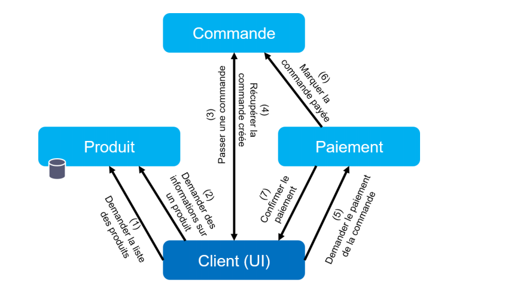
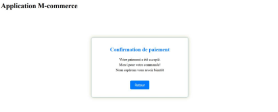

# Microservice Cloud-Native Application with Kubernetes and ArgoCD

## Overview

Welcome to the Microservice Cloud-Native Application project! In this repository, you will find all the necessary Kubernetes YAML files required to deploy our mini microservice cloud-native application within a local Kubernetes cluster. Additionally, we've integrated the ArgoCD tool to automatically detect changes in the GitLab repository containing the Kubernetes YAML files, allowing us to extend the GitLab CI pipeline to deploy each updated microservice into the local Kubernetes cluster.

## Architecture of the application :

## The app is Running:

